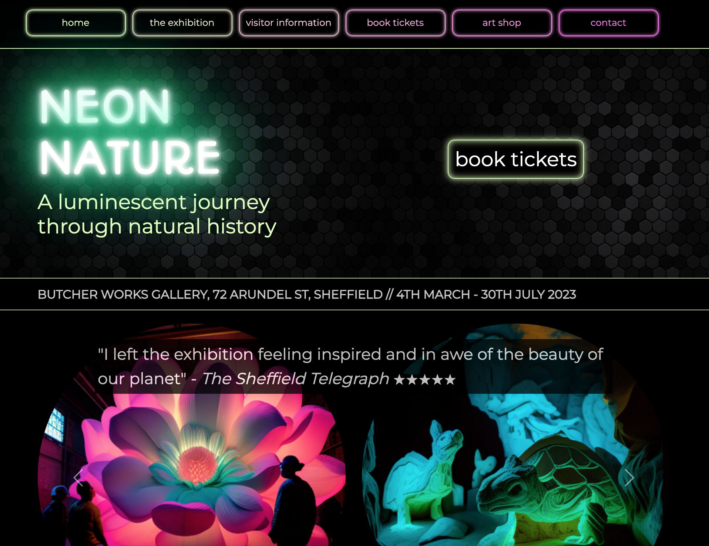
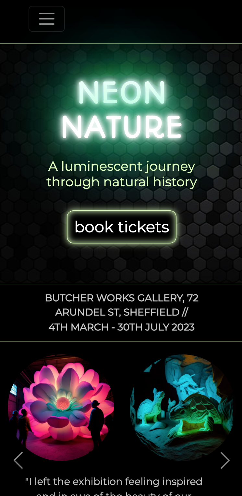

# Neon Nature

This a a group project completed as part of the **Web Development Kickstarter** course run by [Code First Girls](https://codefirstgirls.com).

## The brief

To work in a group to create a website project meeting the following criteria.

Must haves:

- a minimum of 2 HTML pages and one external CSS file
- a website wireframe
- use a CSS framework
- all links working
- basic user interaction (e.g. hover, submit form, action on click)
- adhering to UI/UX rules

Nice to haves: 

- mobile responsive
- effective use of classes and IDs
- JavaScript used to enable user interaction

## Contributors

Husna C 
Jen Gori 
Victoria McCusker 
Daniella Omokore

## Our project: Neon Nature

Our project is a website for a fictional art exhibition called "Neon Nature". 

It consists of 6 pages:

- Home: the website home page
- The Exhibition: a page giving further detail about the exhibition
- Visitor Information: including opening times, location, faqs etc.
- Book Tickets: a form to book tickets for the exhibition
- Art Shop: (page not developed)
- Contact: a form to submit queries about the exhibition

The website uses the **Bootstrap** framework alongside a local CSS file. The Bootstrap framework is used to implement the following elements:

-  navbar
- carousel on home page
- responsive layout on home page and visitor information page
- accordion layout for FAQs section on visitor information page
-  footer

The website uses **JavaScript** to:

- display a message to the user on submission of the newsletter signup form in the website footer
- display a message to the user on submission of the contact form on the Contact page

The website also makes use of **Google Fonts** and **Font Awesome** icons. 

The images of the exhibition used in the project were generated using the **Midjourney** Bot on Discord.

## Screenshots

## Links

- Repository URL: 
- Live Site URL:
